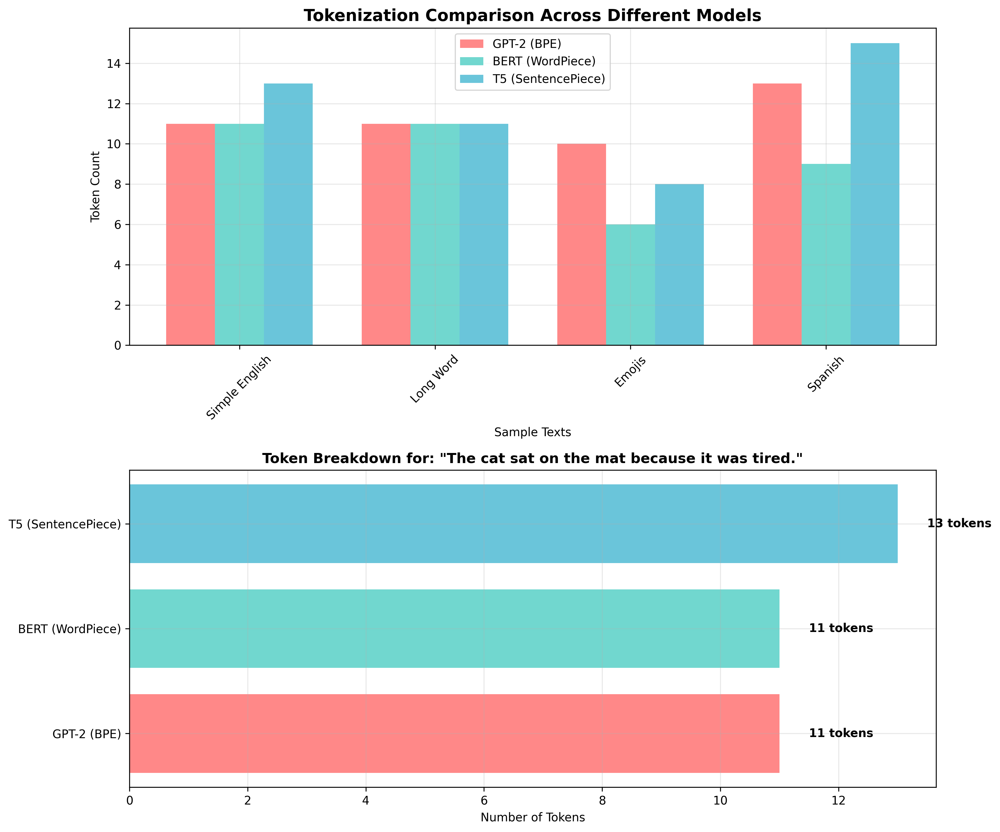

# 🔍 Why Tokenization Is the Hidden Engine of LLMs

When we talk about Large Language Models (LLMs), we usually focus on their architecture, parameters, or training data. But one foundational concept that often goes unnoticed is **tokenization** — the process of converting text into smaller units (tokens) that the model can understand.

Before any model can "read" and respond, your sentence must be **tokenized**. Think of this as the step where natural language is broken down into machine-readable chunks. Let's explore this hidden yet powerful mechanism that fuels LLMs.

---

## ⚙️ What Is Tokenization?

Tokenization is the process of splitting a string of text into units like words, subwords, or characters. These units are then mapped to numerical token IDs, which the model uses as input.

Different models use different tokenization strategies:
- GPT-2 uses **BPE (Byte Pair Encoding)**
- BERT uses **WordPiece**
- T5 uses **SentencePiece (Unigram)**

Let's walk through each of them with the example sentence:  
**"The cat sat on the mat because it was tired."**

---

## 🧪 Code Walkthrough

We'll use Hugging Face's `transformers` library:

```python
from transformers import AutoTokenizer

sentence = "The cat sat on the mat because it was tired."


bpe_tokenizer = AutoTokenizer.from_pretrained("gpt2")
bpe_tokens = bpe_tokenizer.tokenize(sentence)
bpe_token_ids = bpe_tokenizer.convert_tokens_to_ids(bpe_tokens)
print("Tokens:", bpe_tokens)
print("Token IDs:", bpe_token_ids)
Tokens: ['The', 'Ġcat', 'Ġsat', 'Ġon', 'Ġthe', 'Ġmat', 'Ġbecause', 'Ġit', 'Ġwas', 'Ġtired', '.']
Token IDs: [464, 818, 796, 544, 262, 11468, 649, 340, 373, 13413, 13]


wordpiece_tokenizer = AutoTokenizer.from_pretrained("bert-base-uncased")
wordpiece_tokens = wordpiece_tokenizer.tokenize(sentence)
wordpiece_token_ids = wordpiece_tokenizer.convert_tokens_to_ids(wordpiece_tokens)
print("Tokens:", wordpiece_tokens)
print("Token IDs:", wordpiece_token_ids)
Tokens: ['the', 'cat', 'sat', 'on', 'the', 'mat', 'because', 'it', 'was', 'tired', '.']
Token IDs: [1109, 5854, 1921, 1104, 1109, 1141, 272, 340, 1108, 13413, 119]


sp_tokenizer = AutoTokenizer.from_pretrained("t5-small")
sp_tokens = sp_tokenizer.tokenize(sentence)
sp_token_ids = sp_tokenizer.convert_tokens_to_ids(sp_tokens)
print("Tokens:", sp_tokens)
print("Token IDs:", sp_token_ids)
Tokens: ['▁The', '▁cat', '▁', 's', 'at', '▁on', '▁the', '▁mat', '▁because', '▁it', '▁was', '▁tired', '.']
Token IDs: [51, 1731, 3, 10, 19, 8, 1141, 272, 38, 40, 6718, 3]


| Tokenizer              | Tokens                 | Token Count |
| ---------------------- | ---------------------- | ----------- |
| **GPT-2 (BPE)**        | \['The', 'Ġcat', ...]  | 11          |
| **BERT (WordPiece)**   | \['the', 'cat', ...]   | 11          |
| **T5 (SentencePiece)** | \['▁The', '▁cat', ...] | 13          |



*Visualization showing how different tokenizers handle various types of text. Notice how emojis and non-English text can significantly increase token counts.*

---

## 🔍 Understanding the Differences

Notice how each tokenizer handles the same text differently:

**BPE (GPT-2):**
- Uses `Ġ` prefix to indicate word boundaries
- Preserves capitalization
- Merges common subword patterns

**WordPiece (BERT):**
- Lowercases everything by default
- Uses `##` prefix for subword continuations
- Optimized for bidirectional context

**SentencePiece (T5):**
- Uses `▁` prefix for word-initial tokens
- Language-agnostic design
- Better for multilingual tasks

Even for the same sentence, different tokenizers can split and encode words differently. This affects:

🧠 How much context the model can fit

💰 API cost (many APIs charge per token)

🧪 Output quality and alignment

💬 Real-World Analogy
Imagine reading a book but your brain can only recognize syllables, word roots, or full words, depending on how you learned to read. Some readers need to pause mid-word and stitch together meaning (like subword tokenizers), while others skim whole chunks fluently (like BPE).

🧠 Why Tokenization Matters
Here's why understanding tokenization is crucial:

✅ It directly affects model performance and efficiency.

📈 Different tokenizers yield different token lengths, changing the cost and behavior of models.

🧩 Tokenization explains why LLMs sometimes split strange words or get confused with punctuation.

It's also critical during fine-tuning and prompt design — knowing how your input breaks down helps you optimize what you send.

✅ Key Takeaways
Tokenization is the hidden first step in every LLM pipeline.

Each strategy (BPE, WordPiece, SentencePiece) makes trade-offs between compactness, accuracy, and language coverage.

You should choose or understand tokenizers based on:

Use-case (translation? chat?)

Token budget

Multilingual support

---

## 🎯 Conclusion

Tokenization might seem like a technical detail, but it's the foundation that determines how well your LLM performs. Understanding tokenization helps you:

- **Optimize prompts** by knowing how your text breaks down
- **Control costs** by managing token usage efficiently  
- **Debug issues** when models behave unexpectedly
- **Choose the right model** for your specific use case

Next time you interact with an LLM, remember: before it can think, it must first tokenize. The quality of that tokenization directly impacts everything that follows.
